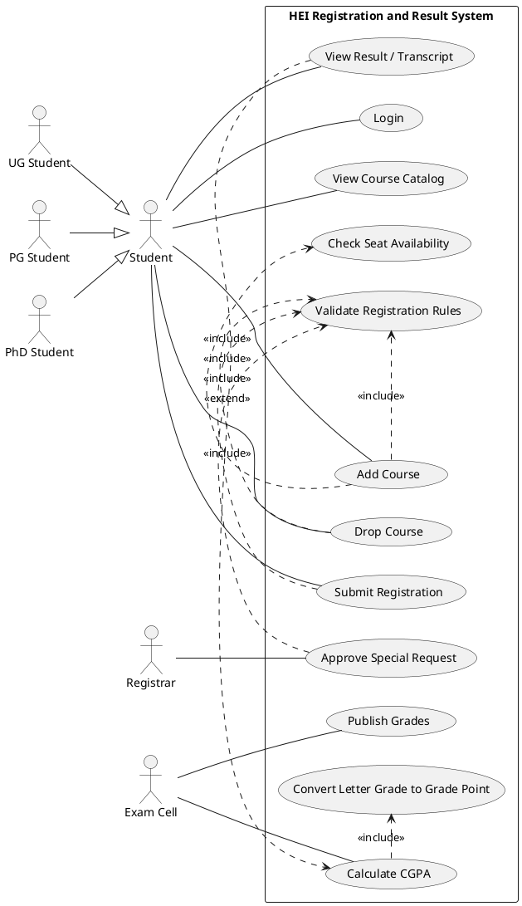
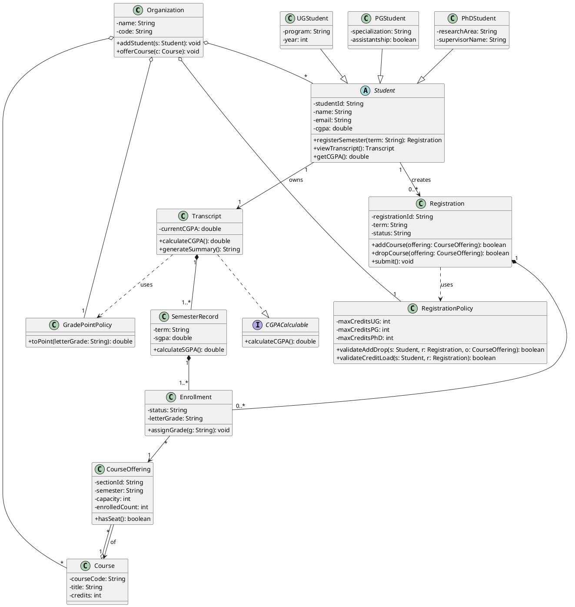
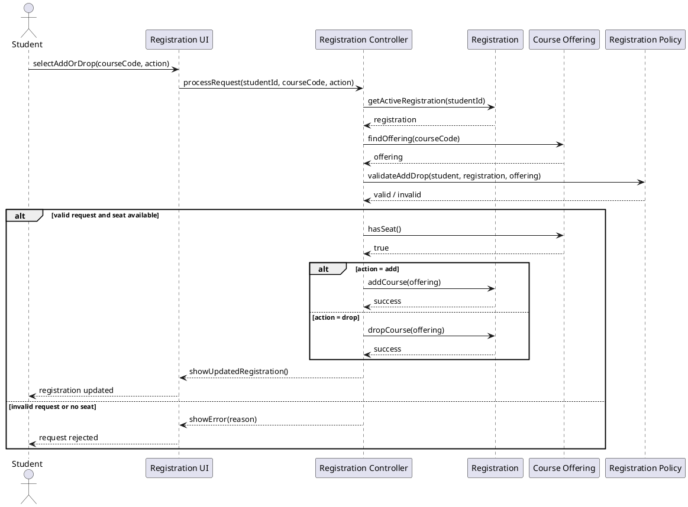
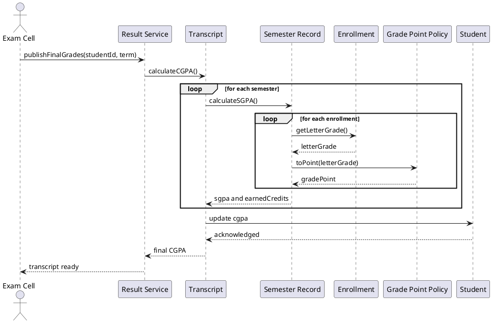

# Assignment III: OOAD with UML for HEI Registration and CGPA System

**Student:** Soumyajyoti Mohanta  
**Roll No.:** 2301AI23  
**Course:** CS 3205 OOP  
**Topic:** UML-based analysis and design for a Higher Education Institute (HEI)

## 1. Problem Statement

The system models a Higher Education Institute such as an IIT, NIT, or Central University. The main requirements are:

- represent the organization with minimal details,
- represent students of type `UG`, `PG`, and `PhD`,
- support course add/drop during semester registration,
- calculate CGPA at semester end,
- show the design using UML use case, class, and sequence diagrams.

The design follows the class notes: actors are placed outside the system boundary, use cases are placed inside the boundary, class diagrams show attributes, operations, multiplicity, and relationships, and sequence diagrams show object interaction over time.

## 2. Use Case Diagram

### Use case notes

- `Student` is a generalized actor, while `UG Student`, `PG Student`, and `PhD Student` are specialized actors.
- `Add Course`, `Drop Course`, and `Submit Registration` include `Validate Registration Rules`.
- `Approve Special Request` extends rule validation for exceptional cases such as overload or late registration.
- `View Result / Transcript` includes `Calculate CGPA`, because the final transcript view depends on computed grade points.

## 3. Class Diagram

### Class diagram notes

- `Student` is an abstract superclass and `UGStudent`, `PGStudent`, and `PhDStudent` inherit from it.
- `Transcript` realizes the `CGPACalculable` interface.
- `Organization` aggregates students, courses, and policies.
- `Registration` composes `Enrollment` objects because enrollments are created for a specific registration context.
- `Transcript` composes `SemesterRecord` objects because semester records are part of one transcript.
- Multiplicity is explicitly shown to follow the lecture emphasis on associations and cardinality.

## 4. Sequence Diagram 1: Course Add / Drop during Registration

## 5. Sequence Diagram 2: Semester-End CGPA Calculation

## 6. Design Justification

### Merits

- The model separates static structure and dynamic behavior clearly.
- Inheritance is used naturally for `UG`, `PG`, and `PhD` students.
- Composition is used where lifecycle dependency exists, such as `Transcript` to `SemesterRecord`.
- The design is modular because policies for registration and grade-point conversion are separated from student data.
- The model supports extension for future entities such as instructor, department, hostel, and fee system.

### Demerits

- The organization is intentionally modeled with limited detail, so real HEI complexity is abstracted away.
- Exceptional workflows such as waitlisting, audit registration, backlog registration, and thesis credits are simplified.
- The sequence diagrams show major interactions, not all low-level validations and database actions.
- A single `RegistrationPolicy` may become large if too many institute-specific rules are added.

### Justification

- A generalized `Student` actor and superclass reduces repetition and matches the UML note on generalization.
- `include` is used in the use case diagram for mandatory reusable behavior such as validation and grade conversion.
- `extend` is used for `Approve Special Request` because it occurs only in exceptional conditions.
- Interface realization through `CGPACalculable` demonstrates abstraction and supports alternate CGPA strategies if required later.
- Multiplicity and ownership relations are shown explicitly because the lecture slides emphasize associations, composition, aggregation, and cardinality.

## 7. Conclusion

The proposed UML design captures the required HEI features: student categorization, registration-time course add/drop, and semester-end CGPA computation. It follows the notation and relationship patterns discussed in class, while keeping the model sufficiently realistic for object-oriented analysis and design.
